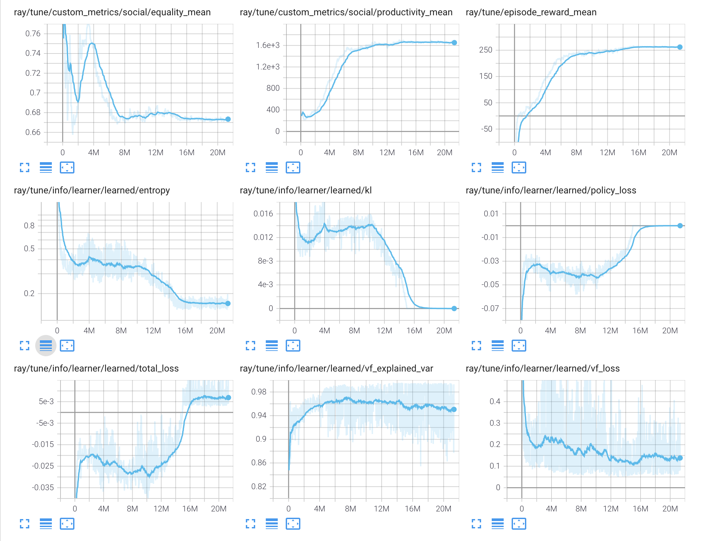
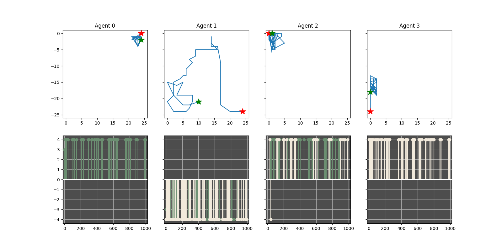
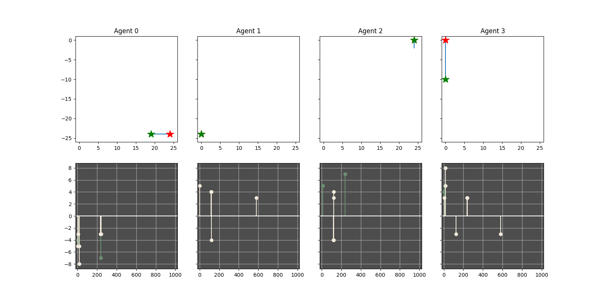
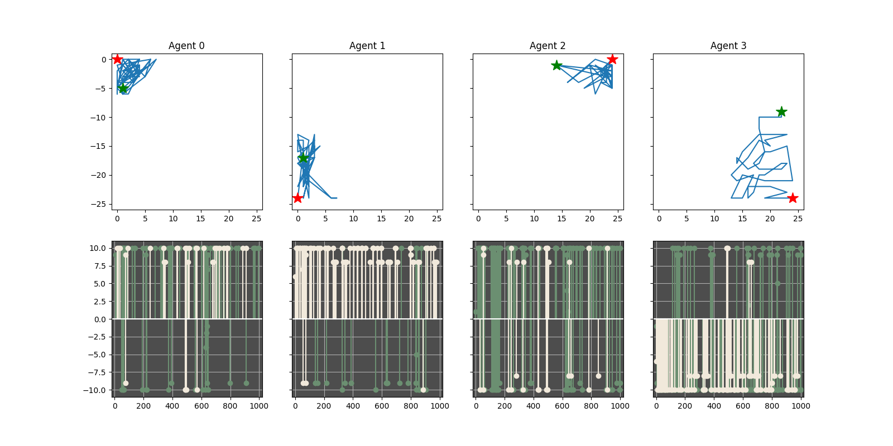
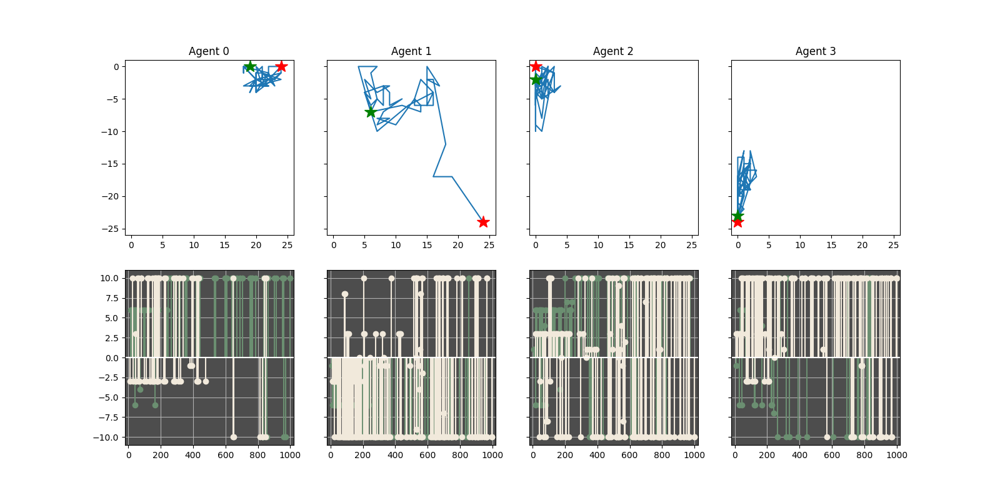

# AI Economist Training Examples

[AI Economist](https://blog.einstein.ai/the-ai-economist/) is a project which aims to research the dynamics of economics by RL. The gym like environment is provided as [salesforce/ai-economist](https://github.com/salesforce/ai-economist).

This repository provides some examples to train agents. Refer more details on my [blog post](https://medium.com/vitalify-asia/ai-economist-sums-up-communism-21260e5540f8).

## Getting started

1. Install [requirements](./requirements.txt).
    * [AI Economist](https://github.com/salesforce/ai-economist)
    * [RLlib](https://github.com/ray-project/ray#rllib-quick-start)
2. Run train script.
```
cd src
python train_free_market.py
```

It trains forever. Please stop it manually.

## Results

This repository contains 4 different experiments.

* Free market
* Communism (Tax rate is 1.0 in all tax brackets.)
* Machine (The reward of agents is social productivity.)
* Dystopia (The reward of agents is social productivity times equality.)

### Free market

It uses exact same environment settings with the [basic tutorial](https://github.com/salesforce/ai-economist/blob/master/tutorials/economic_simulation_basic.ipynb) at [salesforce/ai-economist](https://github.com/salesforce/ai-economist).






```
'social/productivity': 2690.0439390798297,
'social/equality': 0.4471018900462562,
```

```
_______________:_ Agent  0 _____|_ Agent  1 _____|_ Agent  2 _____|_ Agent  3 ____
Cost (Wood)    :    ~~~~~~~~    |   3.99 (n=104) |    ~~~~~~~~    |    ~~~~~~~~   
Cost (Stone)   :    ~~~~~~~~    |   4.00 (n= 96) |   4.00 (n=  1) |    ~~~~~~~~   
Income (Wood)  :   3.98 (n= 53) |    ~~~~~~~~    |   4.00 (n= 51) |    ~~~~~~~~   
Income (Stone) :    ~~~~~~~~    |    ~~~~~~~~    |   4.00 (n= 28) |   4.00 (n= 69)
Income (Build) :    ~~~~~~~~    |  22.25 (n=108) |  16.47 (n= 15) |    ~~~~~~~~   
```

## Communism

In this scenario, the tax rate is fixed to 100% in all tax brackets.




```
'social/productivity': 189.97005877338054,
'social/equality': 0.9508694507250395,
```

```
_______________:_ Agent  0 _____|_ Agent  1 _____|_ Agent  2 _____|_ Agent  3 ____
Cost (Wood)    :   5.50 (n=  6) |    ~~~~~~~~    |    ~~~~~~~~    |    ~~~~~~~~   
Cost (Stone)   :   4.50 (n=  6) |   4.00 (n=  1) |   4.00 (n=  2) |   3.00 (n=  2)
Income (Wood)  :    ~~~~~~~~    |    ~~~~~~~~    |   6.00 (n=  4) |   4.50 (n=  2)
Income (Stone) :    ~~~~~~~~    |   4.00 (n=  4) |   3.50 (n=  2) |   4.40 (n=  5)
Income (Build) :  22.25 (n=  6) |    ~~~~~~~~    |    ~~~~~~~~    |  16.47 (n=  1)
```

## Machine

In this scenario, the reward of agents is the social productivity. Agents do not feel happy or not.




```
'social/productivity': 3132.268504114142,
'social/equality': 0.6526407820720013,
```

```
_______________:_ Agent  0 _____|_ Agent  1 _____|_ Agent  2 _____|_ Agent  3 ____
Cost (Wood)    :   8.35 (n= 20) |   9.21 (n= 24) |   9.73 (n= 45) |   9.91 (n=155)
Cost (Stone)   :   9.80 (n=  5) |   9.33 (n=  3) |   9.53 (n= 17) |   9.30 (n=116)
Income (Wood)  :   9.88 (n= 82) |  10.00 (n=  9) |   9.68 (n=110) |   9.23 (n= 43)
Income (Stone) :   9.62 (n= 29) |   9.28 (n= 92) |   9.21 (n= 14) |   9.33 (n=  6)
Income (Build) :  16.47 (n= 25) |  13.27 (n= 15) |  11.33 (n=  3) |  22.25 (n=110)
```

## Dystopia

In this scenario, the reward of agents is the social productivity times equality. Agents do not feel happy or not.




```
'social/productivity': 2771.729132913341,
'social/equality': 0.9708581023629138,
```

```
_______________:_ Agent  0 _____|_ Agent  1 _____|_ Agent  2 _____|_ Agent  3 ____
Cost (Wood)    :   8.44 (n=  9) |   8.15 (n= 78) |   8.76 (n= 21) |   8.52 (n= 27)
Cost (Stone)   :   4.03 (n= 37) |   8.62 (n=138) |   9.63 (n= 78) |   7.00 (n= 30)
Income (Wood)  :   8.58 (n= 59) |  10.00 (n=  1) |   7.97 (n= 62) |   8.92 (n= 13)
Income (Stone) :   9.78 (n= 32) |   8.15 (n= 46) |   6.99 (n=100) |   8.70 (n=105)
Income (Build) :  11.33 (n=  5) |  22.25 (n= 97) |  16.47 (n= 26) |  13.27 (n= 13)
```

## Technical notes

The hyper parameters and the methods are not exact same with the original paper. Here are the main differences.

* Used fc net, not conv net, with flatten observations.
* Not used LSTM.
    * I tried [train_lstm.py](src/train_lstm.py), but the result is almost same at least in free market.
* The value function shares weights with pi function.

Some notes.

* LayerNorm was essential in my experiments.
* Observation is not scaled. (It's not mentioned on paper.)
* Communism should have used 2 phase training and tax annealing.
